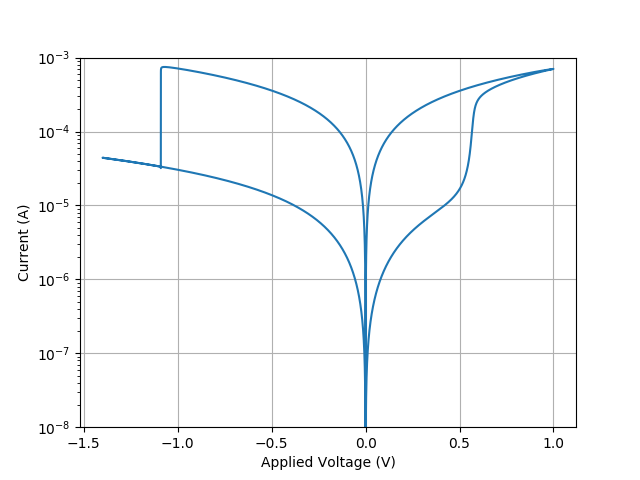

# Physics-based compact modeling of HfO2/TiOx bilayer ReRAM cells

This is an implementation for the [Improved Switching Stability and the Effect of an Internal Series Resistor in HfO2/TiOx Bilayer ReRAM Cells](https://ieeexplore.ieee.org/document/8405556).

1. The model currently simulates IV characteristics of TE / Ti(10nm) / TiO2(3nm) / HfO2(3nm) / BE.
2. The model captures the gradual SET and abrupt RESET.
3. Filament geometry is considered a combination of two pieces: plug (constant) and disc (evolves).
4. It uses the Schottky barrier to model the high work function of metal/oxide interfaces, which is a function of defect concentration of the oxide.

# Requirements

The code requires only `numpy`, `scipy` and `matplotlib`, which can be installed with Conda.

# Generating IV curve

To generate an IV curve with given material properties, run 

`python model.py`.

# Example IV graph

